# 📚 Dự án: Hỗ Trợ và Theo Dõi Việc Tự Học

## 1️⃣ Mô tả dự án

**Hỗ Trợ và Theo Dõi Việc Tự Học** là một ứng dụng web cá nhân hóa giúp người dùng quản lý quá trình tự học một cách toàn diện. Dành cho học sinh, sinh viên, người đi làm, hoặc bất kỳ ai đang học một kỹ năng mới, ứng dụng tập trung vào việc hình thành thói quen học tập bền vững, theo dõi tiến độ và đánh giá kết quả.

Các chức năng chính:
- **Calendar**: Ghi nhận lịch học, tổng hợp số buổi và giờ học.
- **To-do List**: Tạo và quản lý nhiệm vụ học tập, theo dõi tiến độ.
- **Library**: Lưu trữ giáo trình, khóa học, liên kết học trực tuyến, đánh dấu trạng thái hoàn thành.

---

## 2️⃣ Công nghệ sử dụng

- ✅ **PHP (Laravel Framework)**
- ✅ **Laravel Breeze**
- ✅ **MySQL (Aiven Cloud)**
- ✅ **Blade Template**
- ✅ **Tailwind CSS**

---

## 3️⃣ Kiến trúc hệ thống

### 3.1 Sơ đồ Database
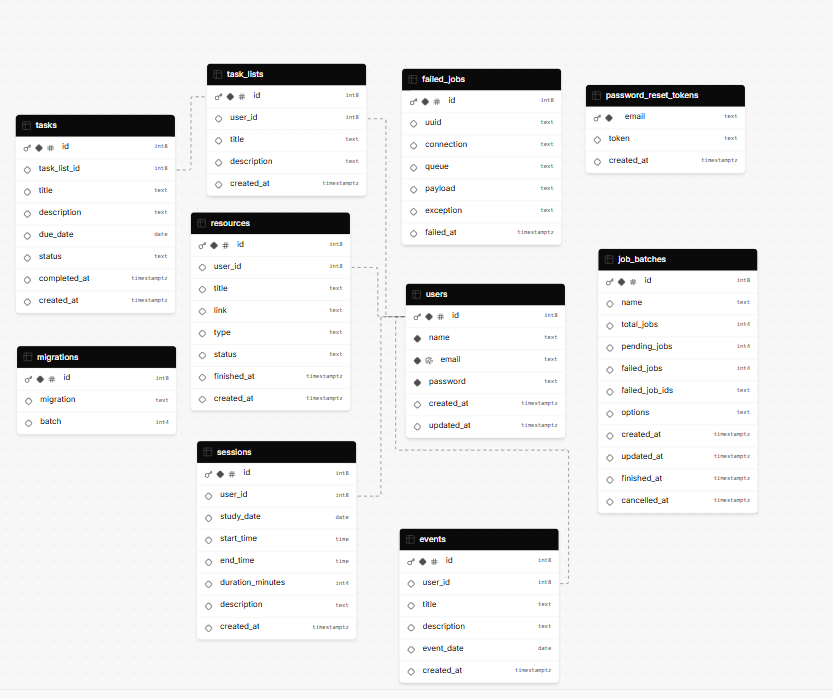
Ứng dụng gồm các bảng chính:
- `users`: người dùng hệ thống
- `study_sessions`: phiên học (thời gian, nội dung)
- `tasks`: nhiệm vụ học tập (To-do list)
- `learning_resources`: tài nguyên học tập (Library)

### 3.2 Các chức năng chính
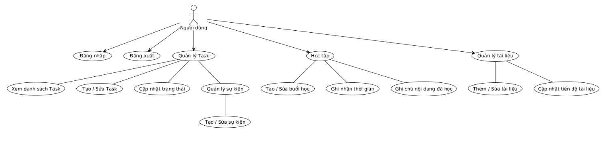

#### 3.2.1 Quản lý người dùng
- Đăng ký / Đăng nhập / Đăng xuất
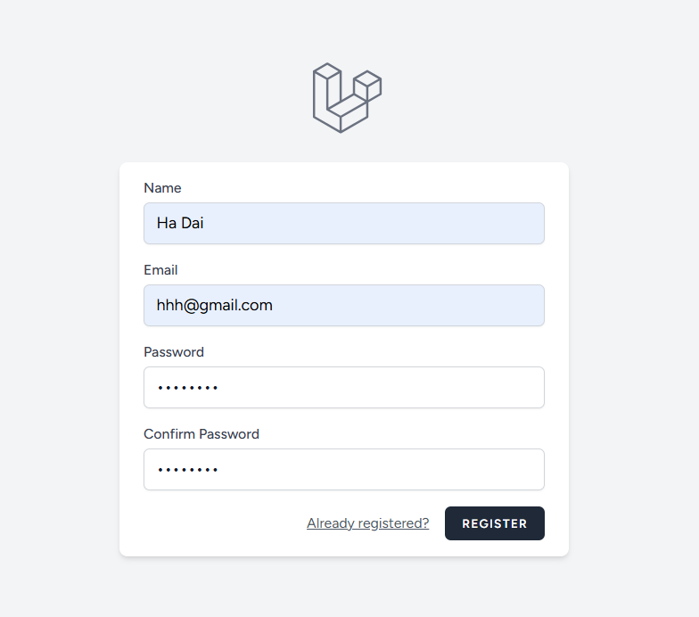

- Cập nhật thông tin cá nhân
- Đổi / reset mật khẩu
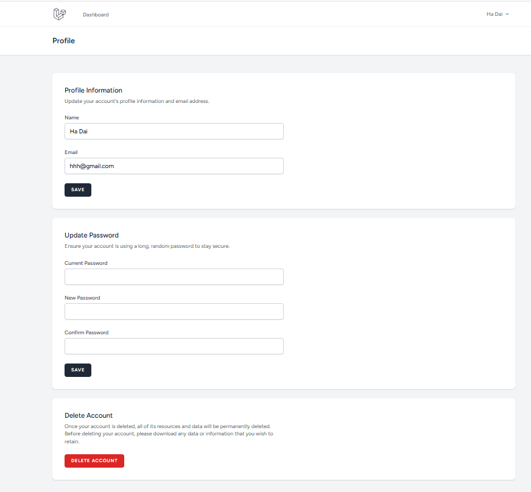

#### 3.2.2 Quản lý thời gian học (Calendar)
- Ghi nhận ngày, giờ học, nội dung
- Hiển thị lịch học dạng calendar
- Thống kê số buổi & số giờ học
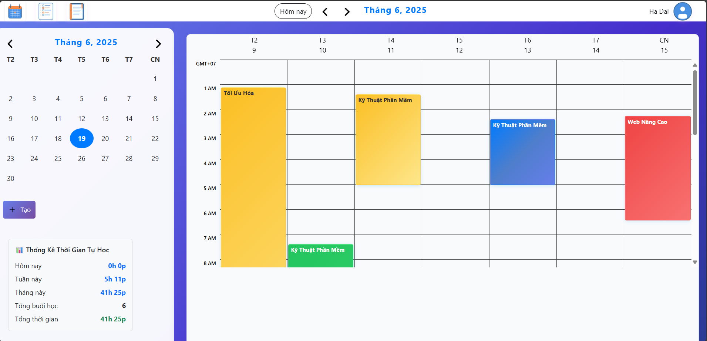

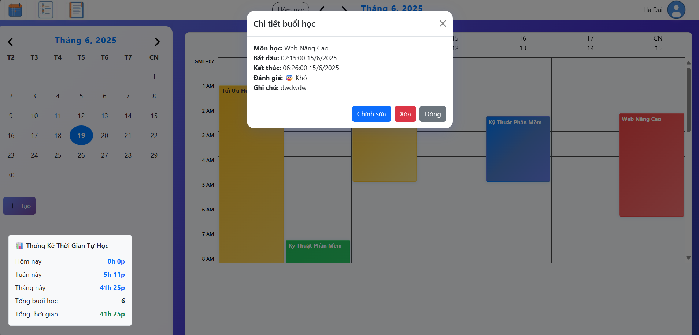

#### 3.2.3 Quản lý công việc (To-do List)
- Thêm / sửa / xóa nhiệm vụ
- Cập nhật trạng thái: đang làm / đã hoàn thành
- Thống kê tiến độ nhiệm vụ

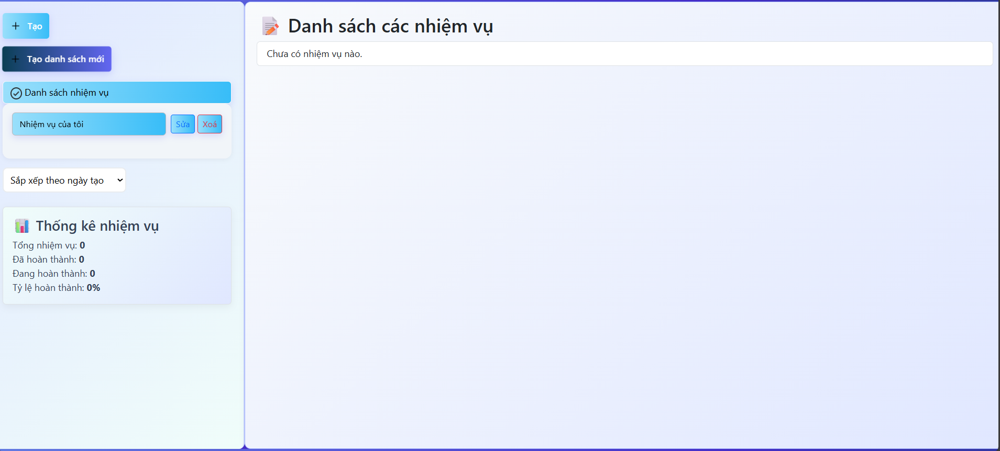

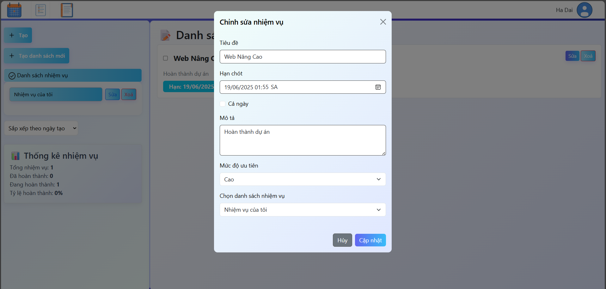

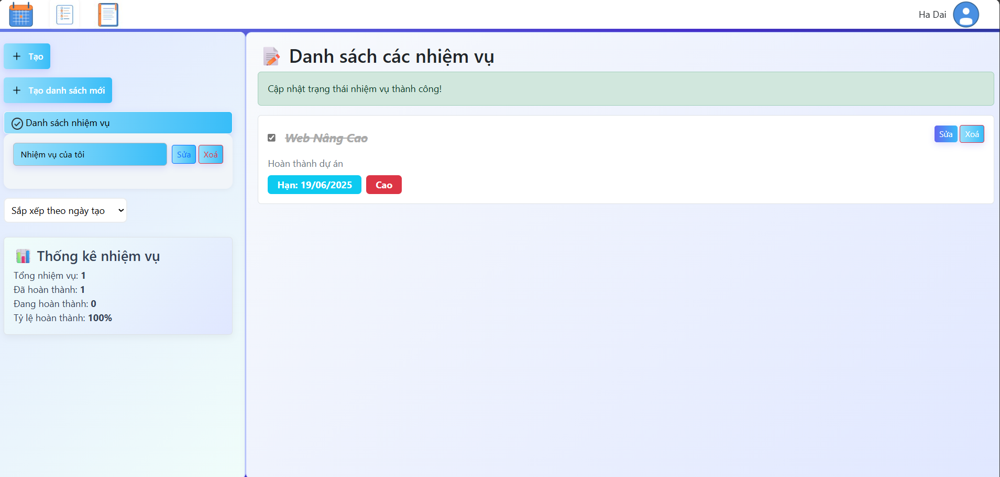

#### 3.2.4 Thư viện học liệu (Library)
- Thêm sách / khóa học / link học tập
- Cập nhật trạng thái: chưa học / đang học / đã hoàn thành
- Theo dõi tiến độ hoàn thành từng tài nguyên

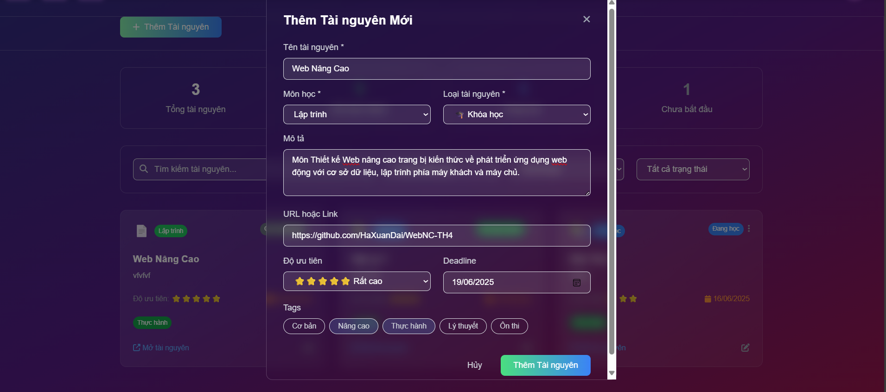

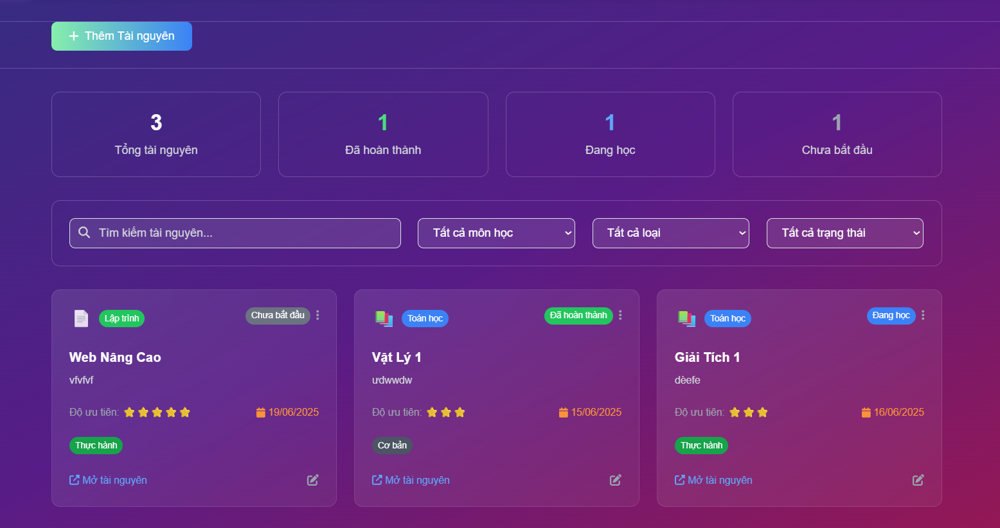

### 3.3 Sơ đồ thuật toán

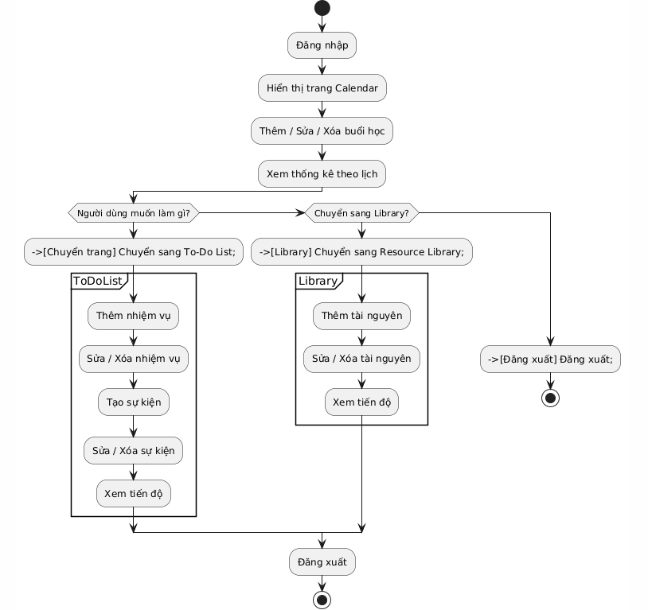

---

## 4️⃣ Các đối tượng chính

| Tên bảng | Vai trò | Mối quan hệ |
|----------|---------|--------------|
| `User` | Tài khoản người dùng | 1-n với `StudySession`, `Task`, `ResourceLibrary` |
| `Task` | Nhiệm vụ học tập | thuộc về `User` |
| `ResourceLibrary` | Tài nguyên học tập | thuộc về `User` |

---

## 5️⃣ Ví dụ một số đoạn mã chính

### 5.1 `ProfileController.php`
```
<?php

namespace App\Http\Controllers;

use App\Http\Requests\ProfileUpdateRequest;
use Illuminate\Http\RedirectResponse;
use Illuminate\Http\Request;
use Illuminate\Support\Facades\Auth;
use Illuminate\Support\Facades\Redirect;
use Illuminate\View\View;

class ProfileController extends Controller
{
    public function edit(Request $request): View
    {
        return view('profile.edit', [
            'user' => $request->user(),
        ]);
    }

    public function update(ProfileUpdateRequest $request): RedirectResponse
    {
        $request->user()->fill($request->validated());
        if ($request->user()->isDirty('email')) {
            $request->user()->email_verified_at = null;
        }
        $request->user()->save();
        return Redirect::route('profile.edit')->with('status', 'profile-updated');
    }

    public function destroy(Request $request): RedirectResponse
    {
        $request->validateWithBag('userDeletion', [
            'password' => ['required', 'current_password'],
        ]);
        $user = $request->user();
        Auth::logout();
        $user->delete();
        $request->session()->invalidate();
        $request->session()->regenerateToken();
        return Redirect::to('/');
    }
}
```


### 5.2 `User.php`
```
<?php

namespace App\Models;

use Illuminate\Database\Eloquent\Factories\HasFactory;
use Illuminate\Foundation\Auth\User as Authenticatable;
use Illuminate\Notifications\Notifiable;

class User extends Authenticatable
{
    use HasFactory, Notifiable;
    protected $fillable = [
        'name',
        'email',
        'password',
    ];

    protected $hidden = [
        'password',
        'remember_token',
    ];

    protected function casts(): array
    {
        return [
            'email_verified_at' => 'datetime',
            'password' => 'hashed',
        ];
    }
}
```
